<style scoped>
h1 {
  font-size: 2.0em;
}
</style>

# 2부 - XRPL 개발자 세션

---

<style scoped>
h1 {
  font-size: 1.9em;
}
li {
  font-size: 1.3em;
}
</style>

# Table of Contents

-   XRP Ledger의 Technical Features 🛠️
-   XRP Ledger의 스마트 컨트랙트 📝
-   XRP Ledger 개발 실습 💻

---

# Part 1 - XRP Ledger의 Technical Features

---

## XRP Ledger의 기술적 특징

<style scoped>
.flex-container {
  display: flex;
  justify-content: space-between;
}
.flex-item {
  width: 50%;
}
</style>

<div class="flex-container">
<div class="flex-item">

-   독특한 합의 알고리즘
-   높은 트랜잭션 처리량과 빠른 속도
-   낮은 수수료
-   스마트 컨트랙트가 없음. (곧 도입 예정)
-   다양한 native features (트랜잭션)
    -   토큰 (Token)
    -   NFT (Non-Fungible Token)
    -   DEX (Decentralized Exchange)
    -   에스크로 (Escrow)

</div>
<div class="flex-item">

</div>
</div>

---

## Ledger of XRPL

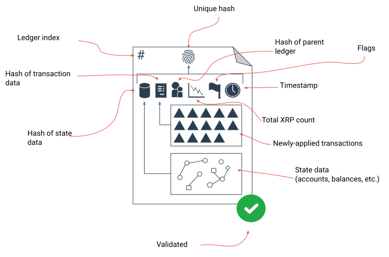

---

## SHAMap

Shared Hashed Memory Associative Prefix tree

<style scoped>
.flex-container {
  display: flex;
  justify-content: space-between;
}
.flex-item {
  width: 50%;
}
</style>

<div class="flex-container">
<div class="flex-item">

-   Merkel Tree
-   Radix(Patricia) Tree

</div>
<div class="flex-item">

-   Transaction SHAMap
-   State SHAMap

</div>
</div>

<div style="display: flex; justify-content: space-around;">
    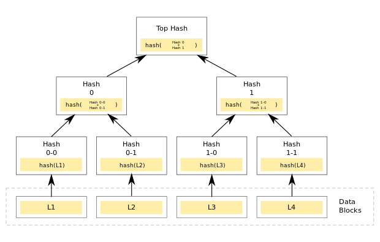
    
</div>

---

## Ledger Version 변경

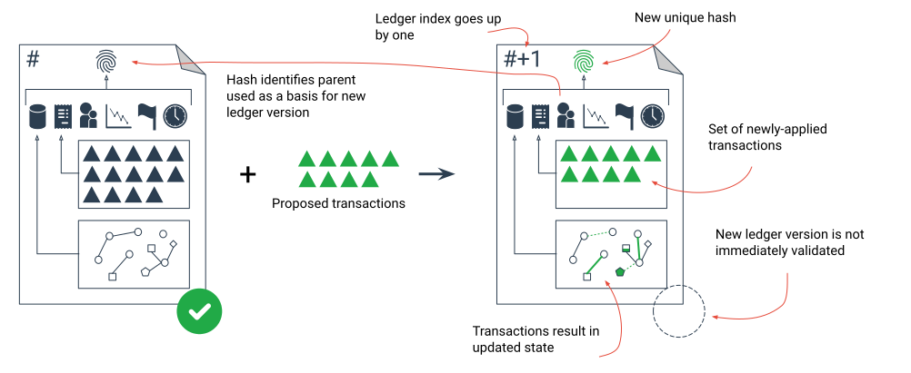

---

## Ripple Protocol Consensus Algorithm (RPCA)

<style scoped>
.flex-container {
  display: flex;
  justify-content: space-between;
}
.flex-item {
  width: 50%;
}
</style>

<div class="flex-container">
<div class="flex-item">

</div>
<div class="flex-item">

-   모든 노드가 아닌 UNL(Unique Node List)에 속한 노드들과 합의 과정을 진행
-   UNL을 통해 Byzantine Fault Tolerance를 보장
-   트랜잭션 처리량, 완결성, 보안성, 에너지 효율성에서 큰 강점이 있음
-   약 1000~1500 TPS
    (Ethereum: 25 TPS, Bitcoin: 7 TPS)

</div>
</div>

---

## 합의 과정

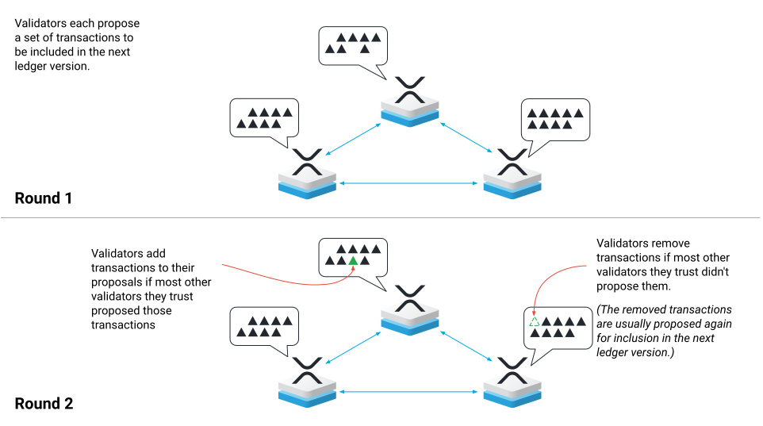

---

## 검증 (Validation)

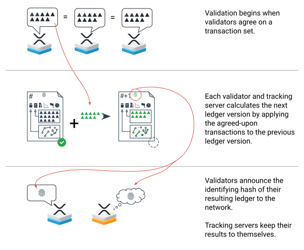

---

## Trust Line

-   `Trust Line`은 XRP 원장에서 토큰을 보유하기 위한 구조입니다.
-   토큰을 보유하려면, 받는 사람이 발행자와 해당 토큰에 대한 Trust Line을 설정해야만 토큰을 보유할 수 있습니다.
-   Trust Line은 해당 토큰에 대해 얼마나 신뢰하고 있는지를 나타냅니다.
-   Trust Line은 양방향 관계로, 다음으로 구성됩니다.
    -   Trust Line이 연결하는 두 계정의 주소
    -   단일 공유 잔액 (한쪽은 양수의 잔액, 다른 쪽은 음수의 잔액)
    -   일반적으로 음수의 잔액을 가진 계정이 토큰의 "발행자"로 간주됩니다.

---

## XRPL의 DEX


---

## XRPL의 DEX

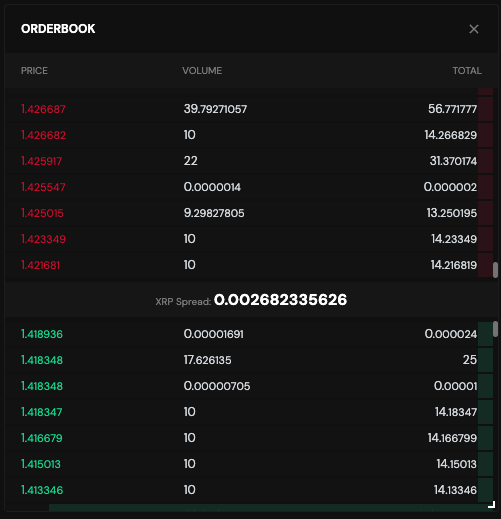

---

## XRPL의 Native DEX

XRP Ledger는 Decentralized Exchange (DEX) 기능을 native하게 지원합니다.

-   **직접적인 자산 교환**: XRPL의 DEX에서는 두 자산 사이의 직접적인 교환을 지원합니다. 이는 거래가 한 단계에서 이루어지므로 빠르고 효율적입니다.

-   **원자적인 거래 (Atomic swap)**: XRPL의 DEX는 원자적 거래를 지원합니다. 이는 거래의 모든 단계가 모두 성공하거나 모두 실패하도록 보장합니다. 이로 인해 거래의 안정성이 높아집니다.

-   **분산 주문장 (Order book)**: XRPL의 DEX는 투명한 주문장을 제공합니다. 주문장은 모든 사용자에게 공개되어 있으며, 누구나 주문을 넣거나 취소할 수 있습니다.

---

-   **자동 경로 찾기 (Auto-bridging)**: XRPL의 DEX는 최적의 거래 경로를 자동으로 찾아줍니다. 이는 여러 자산을 거치는 복잡한 거래도 최적의 가격으로 이루어지게 해줍니다.

-   **다양한 자산 지원**: XRPL의 DEX에서는 XRP를 비롯한 다양한 종류의 자산을 거래할 수 있습니다. 사용자는 누구나 새로운 자산을 만들어 거래할 수 있습니다.

-   **빠른 결제 시간**: XRPL의 블록 생성 시간은 약 3-5초로, 이로 인해 거래의 최종성이 매우 빠르게 달성됩니다. 이는 특히 빠른 결제를 필요로 하는 환경에서 유용합니다.

-   **보안성**: XRPL의 DEX는 XRPL의 합의 프로토콜에 의해 보호받으며, 이는 거래의 안정성과 보안성을 높여줍니다.

-   **접근성**: XRPL의 DEX는 분산형 네트워크에 위치해 있으므로, 중앙 집중형 서버의 장애나 관리자의 제한 없이 누구나 사용할 수 있습니다.

---

<style scoped>
pre {
  font-size: 0.74em;
}
</style>

## Trust Line과 DEX 사용 예시

Alice가 Bob이 발행한 USD 토큰을 100개 사려는 상황

1. **Trust Line 설정**: Alice는 Bob의 USD 토큰과 Trust line을 100개 한도로 맺습니다.

```json
{
    "TransactionType": "TrustSet",
    "Account": "Alice의 주소",
    "Fee": "12",
    "Flags": 262144,
    "LastLedgerSequence": 8007750,
    "LimitAmount": {
        "currency": "USD",
        "issuer": "Bob의 주소",
        "value": "100"
    },
    "Sequence": 12
}
```

---

<style scoped>
pre {
  font-size: 0.74em;
}
</style>

2. **거래 시작**: Alice가 100 USD 코인을 500 XRP로 사기로 결정 하면, 그 트랜잭션을 XRPL에 제출합니다. 이 과정은 주로 `OfferCreate`라는 트랜잭션에 의해 이루어지며, 이는 XRPL의 네이티브한 DEX를 사용하는 트랜잭션입니다.

```json
{
    "TransactionType": "OfferCreate",
    "Account": "Alice의 주소",
    "Fee": "12",
    "Sequence": 10,
    "TakerGets": {
        "currency": "USD",
        "issuer": "Bob의 주소",
        "value": "100"
    },
    "TakerPays": "50000000", // 1 XRP = 100,000 drops, 500 XRP
    "Flags": 0
}
```

---

<style scoped>
.flex-container {
  display: flex;
  justify-content: space-between;
}
.flex-item {
  width: 50%;
}
</style>

3. **거래 성공 및 잔액 확인**: XRPL의 합의 과정을 통해 트랜잭션이 성공적으로 처리되면, Alice는 Bob에게 500 XRP를 지불하고, 반대로 Bob은 Alice에게 100 USD를 전송하게 됩니다.

<div class="flex-container">
<div class="flex-item">

-   Alice의 Bob과의 Trust Line

```json
{
    "Account": "Alice의 주소",
    "Balance": "100", // Alice now holds 100 USD tokens issued by Bob
    "Currency": "USD",
    "Limit": "200", // Assuming Alice set a limit of 200 USD
    "LimitPeer": "0", // Assuming Bob did not set a limit for Alice
    "QualityIn": 0,
    "QualityOut": 0,
    "Issuer": "Bob의 주소",
    "Flags": 131072
}
```

</div>
<div class="flex-item">

-   Bob의 Alice와의 Trust Line

```json
{
    "Account": "Bob의 주소",
    "Balance": "-100", // Bob owes 100 USD tokens to Alice
    "Currency": "USD",
    "Limit": "0", // Assuming Bob did not set a limit for Alice
    "LimitPeer": "200", // Bob knows that Alice set a limit of 200 USD
    "QualityIn": 0,
    "QualityOut": 0,
    "Issuer": "Alice의 주소",
    "Flags": 131072
}
```

</div>
</div>

---

## XLS-30d: XRPL Native AMM DEX Proposal

-   Geometric Mean Price (GMP)를 이용한 AMM (Automated Market Maker) DEX
-   pool은 토큰과 토큰 혹은 토큰과 XRP로 구성될 수 있음
-   pool이 없다면 만들 수 있고, 이미 있다면 새로 만들 수 없음
-   예치를 하면 LP 토큰을 받고, LP 토큰을 소각하면 예치한 토큰을 돌려받음
-   pool을 사용할 때, 자산의 비율을 바꾸면, 설정되어있는 수수료가 풀에 귀속되어 LP들에게 분배됨
-   LP 토큰은 풀의 소유권을 나타내는 토큰으로, 두가지의 유틸리티가 있음
    -   수수료 0% 경매
    -   Fee Voting

---

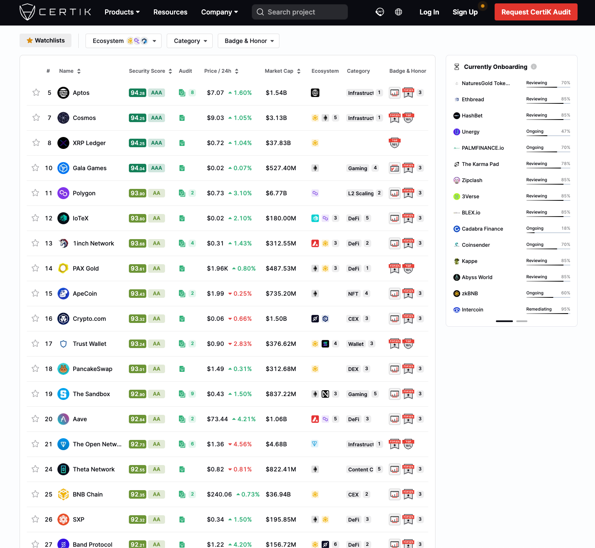

---

# Part 2 - XRP Ledger의 스마트 컨트랙트

---

<style scoped>
li {
  font-size: 1.32em;
}
</style>

# Sidechains of XRP Ledger

-   Hooks 🪝
-   Peersyst
-   Coreum

---

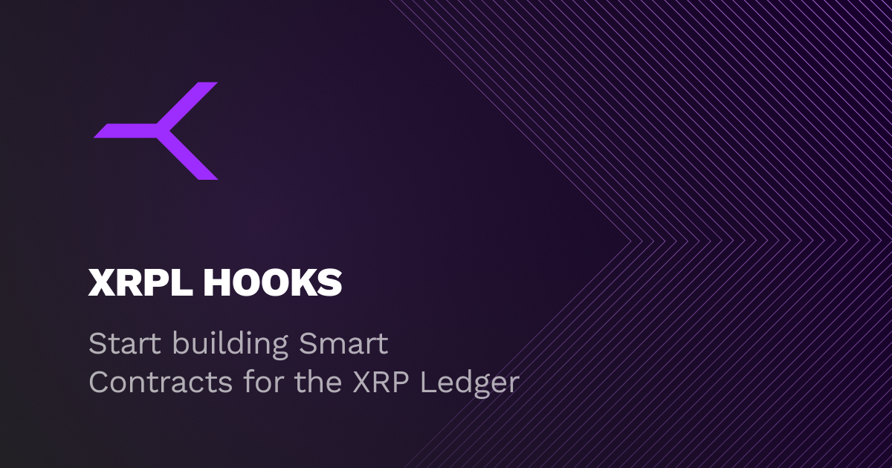

---

## Hooks: 스마트 컨트랙트 기능을 XRPL에 추가

<style scoped>
.flex-container {
  display: flex;
  justify-content: space-between;
}
.flex-item {
  width: 50%;
}
</style>

<div class="flex-container">
<div class="flex-item">

-   Hooks는 XRPL 계정에서 정의되는 작고 효율적인 코드
-   트랜잭션 전후에 로직을 실행
-   효율적인 로직 실행과 간단한 데이터 객체 저장 가능
-   XRPL-Labs에 의해 개발

</div>
<div class="flex-item">

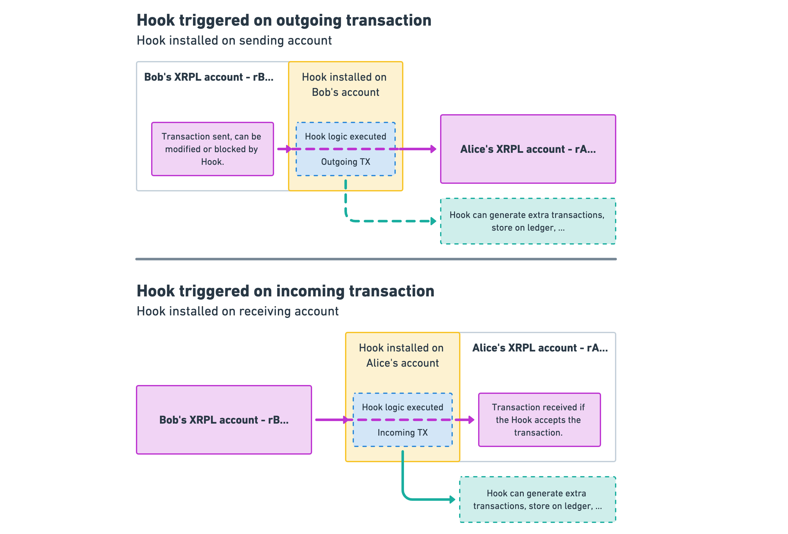

</div>
</div>

---

<style scoped>
li {
  font-size: 1.1em;
}
</style>

## Hooks의 활용 예시

-   "10 XRP 미만의 결제 거부"
-   "모든 나가는 결제의 10%를 저축 계정으로 이동"
-   "송금 계정이 특정 목록에 있는지 확인 후, 있으면 거래 거부"

---

## Hooks 개발 언어

-   WebAssembly (WASM)를 이용한 개발
-   고의적으로 튜링 완전하지 (Turing-Complete) 않음.
-   C, C++, Rust, Go, AssemblyScript 등의 언어로 개발 가능 (주로 C/C++)

<div style="display: flex; justify-content: space-around;">
    
    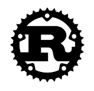
    
</div>

---

## Hooks의 현재 상태와 미래 전망

-   현재 public testnet에서 직접 테스트 가능
    wss://hooks-testnet-v3.xrpl-labs.com
-   테스트, 코딩, 실험 등을 통해 미래의 XRP Ledger mainnet에 Hooks를 추가하기 위한 수정안 준비

---

## EVM Sidechain - Peersyst

-   Main 체인을 보호하면서 확장성을 제공
-   EVM 기반의 월렛과 Solidity 스마트 컨트랙트 사용 가능
-   PoA (Proof of Authority) 기반의 합의 알고리즘 (CometBFT)
-   cosmos-sdk 이용해 개발되었음
-   XRPL bridge를 통해 XRP Ledger와 연결

---

# Part 3 - XRP Ledger 개발 실습

<style scoped>
.flex-container {
  display: flex;
  justify-content: space-between;
}
.flex-item {
  width: 50%;
}
</style>

<div class="flex-container">
<div class="flex-item">

Google Colab에서 실습을 진행합니다.

모바일로도 참여 가능합니다!

https://bit.ly/xrpl-dev-session

</div>
<div class="flex-item">

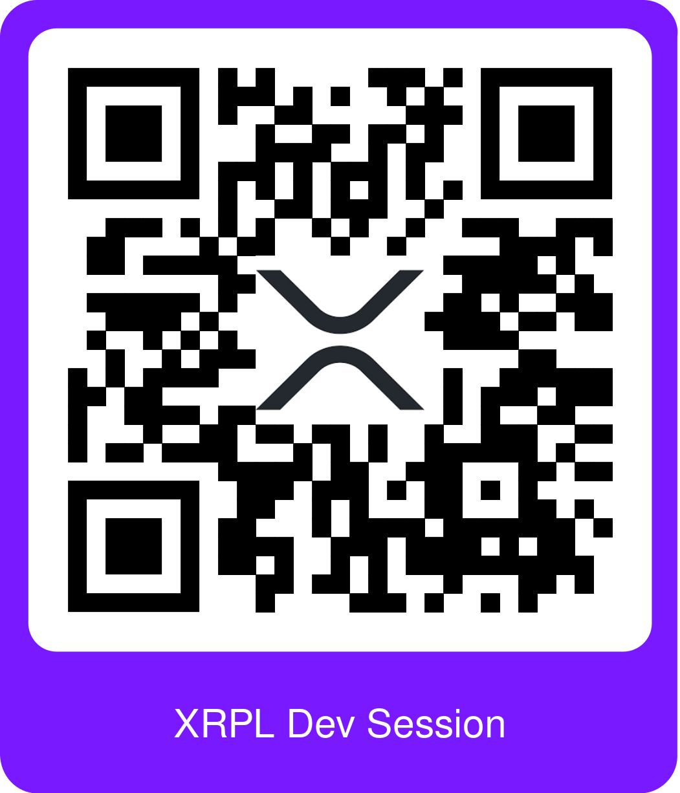

</div>
</div>

---

## Further Information

-   [XRPL Developer Portal](https://xrpl.org)
-   [XRPL Foundation](https://foundation.xrpl.org/)
-   [SHAMap](https://github.com/XRPLF/rippled/blob/develop/src/ripple/shamap/README.md)
-   [RPCA Whitepaper](https://ripple.com/files/ripple_consensus_whitepaper.pdf)
-   [Sologenic](https://www.sologenic.com/)
-   [XLS-30d AMM](https://opensource.ripple.com/docs/xls-30d-amm/amm-uc/)
-   [XLS-30d AMM (more technical)](https://github.com/XRPLF/XRPL-Standards/discussions/78)
-   [Hooks](https://xrpl-hooks.readme.io/)
-   [EVM Sidechain](https://opensource.ripple.com/docs/evm-sidechain/intro-to-evm-sidechain/)
